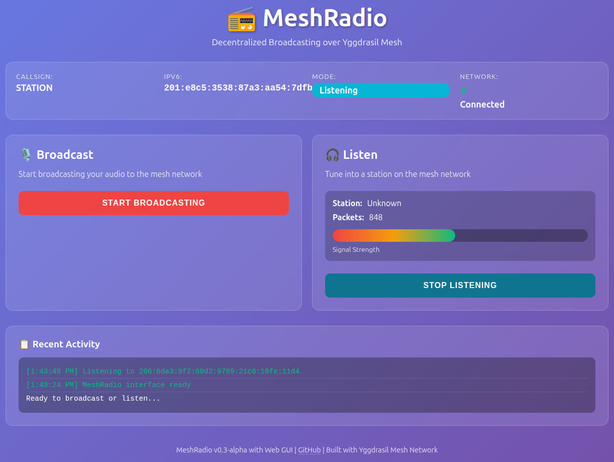

#  MeshRadio

> **Decentralized Voice Broadcasting over Yggdrasil Mesh Network**

[](https://github.com/immartian/meshradio)
[](LICENSE)
[](https://golang.org)

```
 ███╗   ███╗███████╗███████╗██╗  ██╗██████╗  █████╗ ██████╗ ██╗ ██████╗
 ████╗ ████║██╔════╝██╔════╝██║  ██║██╔══██╗██╔══██╗██╔══██╗██║██╔═══██╗
 ██╔████╔██║█████╗  ███████╗███████║██████╔╝███████║██║  ██║██║██║   ██║
 ██║╚██╔╝██║██╔══╝  ╚════██║██╔══██║██╔══██╗██╔══██║██║  ██║██║██║   ██║
 ██║ ╚═╝ ██║███████╗███████║██║  ██║██║  ██║██║  ██║██████╔╝██║╚██████╔╝
 ╚═╝     ╚═╝╚══════╝╚══════╝╚═╝  ╚═╝╚═╝  ╚═╝╚═╝  ╚═╝╚═════╝ ╚═╝ ╚═════╝
```

##  What is MeshRadio?

MeshRadio brings HAM radio-style broadcasting to the **Yggdrasil mesh network**. Use IPv6 addresses as "frequencies" to broadcast and listen to audio streams across the mesh - no central servers required!

**Think of it as:**
- Your own decentralized radio station 
- Peer-to-peer audio streaming 
- HAM radio for the internet age 

---

##  Current Status: v0.3-alpha

###  STABLE MUSIC STREAMING ACHIEVED!

Recent development has delivered **production-quality continuous music broadcasting**:

-  **Smooth, jitter-free audio** - Ticker-based packet pacing eliminates bursts
-  **Multi-hour stability** - Tested with 93-song playlists without interruption
-  **Seamless song transitions** - Shared subscription manager keeps listeners connected
-  **High-quality compression** - Opus codec at 128kbps (12-13x compression)
-  **Web GUI** - Browser-based control interface with real-time monitoring
-  **Playlist looping** - Automatic cycling through your music collection

---

##  Quick Start

### Prerequisites

```bash
# 1. Install FFmpeg (required for MP3 decoding)
sudo apt install ffmpeg       # Ubuntu/Debian
brew install ffmpeg           # macOS
sudo dnf install ffmpeg       # Fedora

# 2. Install Yggdrasil (optional - works on localhost for testing)
sudo apt install yggdrasil    # Ubuntu/Debian
brew install yggdrasil-go     # macOS
```

### Installation

```bash
git clone https://github.com/immartian/meshradio.git
cd meshradio
./build.sh
```

### Test It Out! 

**Terminal 1 - Start Music Broadcaster:**
```bash
./music-broadcast --dir ~/Music --callsign DJ-AWESOME
```

**Terminal 2 - Listen:**
```bash
./meshradio
# Select "3" for Listener
# Enter IPv6: ::1
# Enter port: 8799
```

**Or use the Web GUI (port 8899):**
```bash
./meshradio --gui --callsign YOUR-CALLSIGN
```
Then open **http://localhost:8899** in your browser.



> **Want to try it now?** Connect to our [24/7 live test station](https://github.com/immartian/meshradio/issues/1)!

---

##  Features

###  Working Now

| Feature | Description | Status |
|---------|-------------|--------|
|  **Music Broadcasting** | Stream MP3 files from your music library |  Stable |
|  **Listening** | Tune into any broadcaster on the mesh |  Stable |
|  **Playlist Management** | Automatic cycling, looping support |  Stable |
|  **Web GUI** | Browser-based control with WebSocket updates |  Working |
|  **Terminal UI** | Beautiful command-line interface |  Working |
|  **High Quality** | Opus codec (128kbps, 48kHz stereo) |  Stable |
|  **Subscription System** | Heartbeat-based connection management |  Stable |
|  **Emergency Priority** | Priority levels for critical broadcasts |  Implemented |

###  In Development

- Voice broadcasting (microphone input)
- Station discovery (mDNS/DHT)
- Multi-listener stress testing
- Recording and time-shifting
- Enhanced metadata (now playing, artist info)

---

##  Usage

###  Web GUI (Easiest)

```bash
./meshradio --gui --callsign DJ-AWESOME --web-port 8899
```

**Features:**
-  Start/stop broadcasting from your microphone
-  Connect to remote stations by IPv6 address
-  Real-time status monitoring with WebSocket updates
-  Live signal strength indicators
-  Clean, responsive interface

**Options:**
- `--port 8799` - Audio port for RTP streaming (default: 8799)
- `--web-port 8899` - HTTP port for web interface (default: 8899)
- `--callsign NAME` - Your station callsign

###  Terminal UI

```bash
./meshradio --callsign YOUR-CALLSIGN
```

**Interactive menu with options:**
1. Music Broadcaster - Stream MP3 files
2. Voice Broadcaster - Broadcast from microphone
3. Listener - Tune into a station
4. Emergency Test - Test priority system
5. Discovery Test - Test mDNS discovery

**Keyboard Controls:**
- `b` - Start/stop broadcasting
- `l` - Start listening
- `s` - Stop listening
- `q` - Quit

###  Music Broadcasting

Stream your music library to the mesh:

```bash
./music-broadcast \
  --dir ~/Music/Jazz \
  --callsign DJ-JAZZ \
  --port 8799 \
  --loop
```

**Options:**
| Flag | Default | Description |
|------|---------|-------------|
| `--dir` | `~/Music` | Music directory to scan |
| `--callsign` | `MUSIC-DJ` | Your station callsign |
| `--port` | `8799` | Broadcast port |
| `--group` | `default` | Multicast group |
| `--loop` | `true` | Loop playlist |

**Output Example:**
```
 Scanning for MP3 files...
 Found 93 MP3 file(s)

 Playlist:
  1. 001. John Coltrane - Blue Train.mp3
  2. 002. Miles Davis - So What.mp3
  ...

  Now playing [1/93]: 001. John Coltrane - Blue Train.mp3
   Duration: 10m42s | Sample Rate: 44100 Hz
 Opus encoded: 3840 bytes → 321 bytes (12.0x compression)
```

---

##  How It Works

### Architecture Overview

```
┌─────────────────────────────────────────────────────────┐
│                   Application Layer                      │
│  ┌──────────┐  ┌──────────┐  ┌────────────────────┐    │
│  │   TUI    │  │ Web GUI  │  │  Music Broadcast   │    │
│  └────┬─────┘  └────┬─────┘  └─────────┬──────────┘    │
├───────┴─────────────┴─────────────────┬─┴───────────────┤
│              Broadcaster / Listener   │                  │
├───────────────────────────────────────┴──────────────────┤
│  ┌─────────────────────────────────────────────────┐    │
│  │       Multicast Overlay (Layer 4)               │    │
│  │  • Shared SubscriptionManager                   │    │
│  │  • Subscriber Tracking & Heartbeats             │    │
│  │  • Group Management                             │    │
│  └─────────────────────┬───────────────────────────┘    │
├────────────────────────┴──────────────────────────────────┤
│  ┌─────────────────────────────────────────────────┐    │
│  │         RTP Audio Streaming (Layer 3)           │    │
│  │  • Packet Sequencing                            │    │
│  │  • Jitter Buffer (3 seconds)                    │    │
│  │  • Paced Sending (20ms intervals)               │    │
│  └─────────────────────┬───────────────────────────┘    │
├────────────────────────┴──────────────────────────────────┤
│  ┌─────────────────────────────────────────────────┐    │
│  │         Opus Audio Codec (Layer 2)              │    │
│  │  • 48kHz Stereo @ 128kbps                       │    │
│  │  • 960 samples/frame (20ms)                     │    │
│  │  • 12-13x Compression Ratio                     │    │
│  └─────────────────────┬───────────────────────────┘    │
├────────────────────────┴──────────────────────────────────┤
│  ┌─────────────────────────────────────────────────┐    │
│  │        UDP Transport (Layer 1)                  │    │
│  │  • IPv6-only (Yggdrasil or ::1)                │    │
│  │  • Port 8799 (default)                          │    │
│  └─────────────────────┬───────────────────────────┘    │
└────────────────────────┴──────────────────────────────────┘
                         │
                         ▼
          ┌──────────────────────────┐
          │  Yggdrasil Mesh Network  │
          │  • End-to-end encryption │
          │  • Global IPv6 routing   │
          │  • NAT traversal         │
          └──────────────────────────┘
```

### Audio Pipeline

**Broadcaster:**
```
MP3 File → FFmpeg (-re) → PCM → Opus (128kbps) → RTP → UDP → Network
```

**Listener:**
```
Network → UDP → RTP → Jitter Buffer → Opus Decoder → PCM → Speakers
```

---

##  Technical Specifications

### Audio Quality

| Parameter | Value |
|-----------|-------|
| Sample Rate | 48,000 Hz |
| Channels | 2 (Stereo) |
| Bit Depth | 16-bit |
| Frame Size | 960 samples (20ms) |
| Bitrate | 128 kbps |
| Codec | Opus (RFC 6716) |
| Compression | ~12-13x |

### Network Performance

| Metric | Value |
|--------|-------|
| Packet Size | ~320 bytes |
| Packet Rate | 50 packets/second |
| Bandwidth | ~130 kbps |
| Latency | <100ms (typical) |
| Jitter Buffer | 3 seconds (150 frames) |
| Heartbeat | Every 5 seconds |
| Timeout | 15 seconds |

---

##  Recent Fixes

### v0.3-alpha (December 2024)

####  Critical: Shared SubscriptionManager Across Songs
**Problem:** Subscribers disappeared when songs changed
**Cause:** Each song created a new broadcaster with fresh SubscriptionManager
**Fix:** Created shared SubscriptionManager passed to all broadcaster instances
**Impact:** Seamless multi-hour playback without subscriber loss

####  Critical: IPv6 Key Matching in Subscription Manager
**Problem:** Heartbeats showed `Equal=true` but didn't update LastSeen
**Cause:** IPv6 string representation inconsistency ("::1" vs "0:0:0:0:0:0:0:1")
**Fix:** Use hex byte representation for consistent map keys
**Impact:** Reliable heartbeat processing

####  Major: Ticker-Based Packet Pacing
**Problem:** Audio bursting and jitter despite FFmpeg `-re` flag
**Cause:** Broadcaster sent all available packets immediately
**Fix:** Added `time.Ticker` to send exactly one packet every 20ms
**Impact:** Smooth, jitter-free playback

####  Major: Audio Callback Timeout Handling
**Problem:** Spurious underruns even with full buffer
**Cause:** `select` with immediate `default` case
**Fix:** Changed to 5ms timeout before outputting silence
**Impact:** Stable playback without false underruns

####  Major: Web GUI Port Separation
**Problem:** Web server conflicted with audio port
**Fix:** Added `--web-port` flag, separated HTTP and RTP ports
**Impact:** Web GUI now works alongside audio streaming

---

##  Troubleshooting

### Audio playback stops after 1-2 minutes
**Status:**  FIXED in v0.3-alpha

Update to latest version. This was caused by:
1. Subscriber disappearing when songs changed → Fixed with shared SubscriptionManager
2. IPv6 key mismatches → Fixed with hex byte key generation

### No audio output
- Verify FFmpeg: `ffmpeg -version`
- Check PortAudio: `sudo apt install portaudio19-dev` (then rebuild)
- Test on localhost first: `::1`

### Can't connect to broadcaster
1. Test locally first: `ping6 ::1`
2. Verify Yggdrasil running: `sudo systemctl status yggdrasil`
3. Get your IPv6: `yggdrasilctl getSelf`
4. Check firewall allows UDP port 8799

### Audio jitter/stuttering
**Should be rare now!** If it occurs:
1. Check network latency: `ping6 -c 10 <broadcaster-ipv6>`
2. Verify CPU usage isn't excessive
3. Check for packet loss in logs

### Debugging and Logs

MeshRadio uses a structured logging system with automatic rotation. Logs are stored in `~/.meshradio/logs/`:

```bash
# View playback logs
tail -f ~/.meshradio/logs/playback.log

# Enable debug logging
export MESHRADIO_LOG_LEVEL=DEBUG
./meshradio --gui --callsign DEBUG-STATION

# Custom log directory
export MESHRADIO_LOG_DIR=/tmp/meshradio-logs
```

See [LOGGING.md](LOGGING.md) for complete documentation.

---

##  Development

### Project Structure

```
meshradio/
├── cmd/                    # Applications
│   ├── meshradio/          # Main TUI/GUI
│   ├── music-broadcast/    # MP3 broadcaster
│   └── *-test/             # Test utilities
├── internal/               # Internal packages
│   ├── broadcaster/        # Broadcasting logic
│   └── listener/           # Receiving logic
├── pkg/                    # Public packages
│   ├── audio/              # Codec & I/O
│   ├── gui/                # Web GUI
│   ├── multicast/          # Subscription management
│   ├── network/            # UDP transport
│   └── protocol/           # Packet formats
└── build.sh                # Build script
```

### Building

```bash
# Build all components
./build.sh

# Build specific component
go build -o meshradio ./cmd/meshradio
go build -o music-broadcast ./cmd/music-broadcast

# Run tests
go test ./...
```

---

##  Contributing

Contributions welcome! Areas needing help:

- [ ] mDNS-based station discovery
- [ ] Multi-listener stress testing
- [ ] Voice broadcasting improvements
- [ ] Recording/playback features
- [ ] Mobile clients
- [ ] Documentation

**How to contribute:**
1. Fork the repository
2. Create feature branch: `git checkout -b feature/amazing-feature`
3. Commit changes: `git commit -m 'Add amazing feature'`
4. Push: `git push origin feature/amazing-feature`
5. Open Pull Request

---

##  License

GPL-3.0 License - see [LICENSE](LICENSE) file

---

##  Credits

Built with:
- **Yggdrasil** - Mesh networking platform
- **Opus** - High-quality audio codec
- **FFmpeg** - Media decoding
- **PortAudio** - Cross-platform audio I/O
- **Bubble Tea** - Terminal UI framework
- **Gorilla WebSocket** - WebSocket support

---

##  Contact

- **GitHub**: https://github.com/immartian/meshradio
- **Issues**: https://github.com/immartian/meshradio/issues
- **Discussions**: https://github.com/immartian/meshradio/discussions

---

<div align="center">

**Made with  for the decentralized web**

*Note: This is alpha software under active development. Expect bugs and breaking changes.*

[ Back to Top](#-meshradio)

</div>
